# Rock, Paper, Scissors, Lizard & Spock
 ## Preface
 I took on this challenge with no JavaScript knowledge what so ever. Before the visitor try this game I want to give the credit to pritishnagpal at www.geeksforgeeks.org who gave me some more insight into how the structure of Javascript works.
 So thank you very much pritishnagpal!
 ## The Game
 
 The Rock, Paper, Scissors, Lizard and Spock game has five option buttons: rock, paper, scissors, Lizard and Spock. When the player clicks on an option, a comment is displayed where you find out if the player or the computer won, or if it was a draw. You have five attempts before the game is over. You can then click on a "Again!" button that appears if you want to try to play one more time.
 ## [Rock, Paper, Scissors, Lizard & Spock](https://freddyfrans.github.io/rock-paper-scissors-lizard-spock/)
 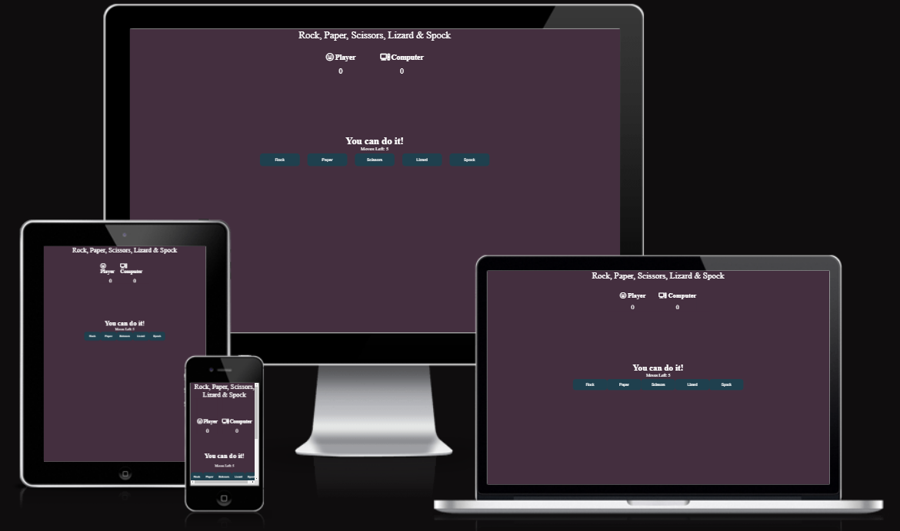
 ## Navigation
- [Features](#features)
- [Features Left to Implement](#features-left-to-implement)
- [Testing](#testing)
- [Technologies Used](#technologies-used)
- [Deployment](#deployment)
- [Credits](#credits)
- [General problem solving credits](#general-problem-solving-credits)
- [Acknowledgements](#acknowledgements)

## Features
- ### Colour Scheme
   - I chose this colorcombination to get a more playful experience.
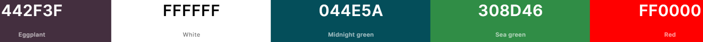
- ### Heading and Score
  - Here you can see Rock, Paper, Scissors, Lizard and Spock heading. Player and Computer with each font awesome image icons to make it more fun. Under the player and computer you can se the scoreboard.
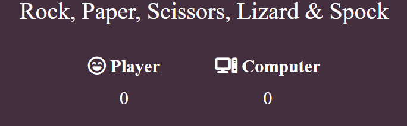

* ### Playing Field
  - Here the player gets five options, where they can choose Rock, Paper, Scissors, Lizard or Spock. If the player beats the computer a message will appear under the playing field.
  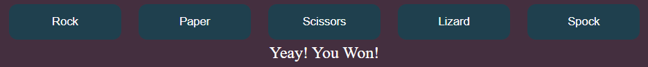
* ### Moves Left
  - The player have a total of five attempts to beat the computer before the game is over.
  
* ### Game Over
  - When the game is over, a new page will be uploaded where the player will find out who won. If the person wants to play once more, they press Again! to start the game.
  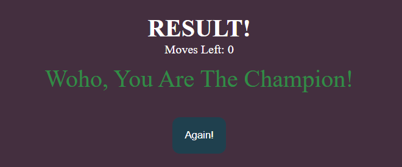

## Features Left to Implement
* ### Favicon
  - I want to change to a more appropriate favicon that reflects the theme of the game.
* ### Images and Layout
  - Experiment with other color combinations and layouts in the game, such as, for example, images on the buttons instead of text and fireworks when the player won the game.
## Testing
  - The game is structured in such a way that you cannot imput emty or invalid data. all to give the user the maximum gaming experience.
  - I have had six people test the functions on the website where all of them uses different types of cellphones, all of them gave the site good feedback. No bugs were found when the people carried out the tests.
 - ### Errors 
   - I had a lot of problem with Codeanywhere, i had to go back to Gitpod 
   - I had a problem with the computer not choosing some selection buttons. This gave errors as you can see below. But after some help from my classmate Frank Arellano i got it sorted out by changing out several typos. Big thanks to Frank Arellano!
 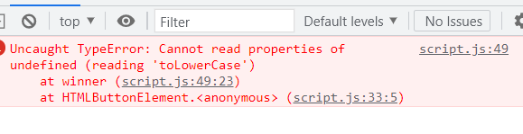
   
 - ### Validator Testing
   - #### HTML
     - No errors were returned when passing through the official [W3C validator.](https://validator.w3.org/nu/#textarea) 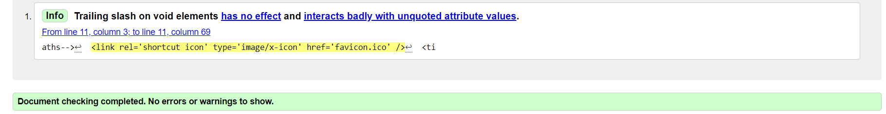
     
     
   - #### CSS
     - No errors were returned when passing through the official  [Jigsaw validator.](https://jigsaw.w3.org/css-validator/validator#css)
     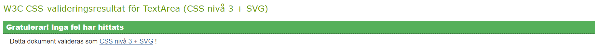
     
   - #### JavaScript
     - No errors were found when passing through the official Jshint validator
    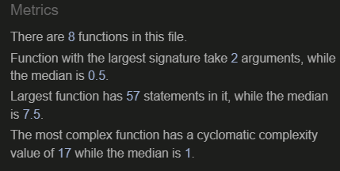
   - #### Lighthouse
   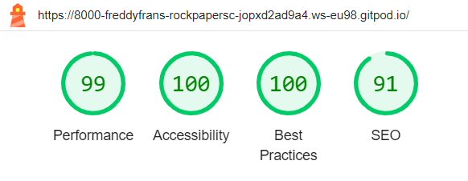
## Technologies Used
   - HTML 5
   - CSS
   - JavaScript
   - Gitpod
   - Github
   - Codeanywhere
## Deployment
   - ### The site was deployed to GitHub pages. The steps to deploy are as follows:
1. In the GitHub repository, navigate to the Settings tab.
2. Once in Settings, navigate to the Pages tab on the left hand side.
  
3. Under Source, select the branch to master, then click save.
  
4. Once the master branch has been selected, the page will be automatically refreshed with a detailed ribbon display to indicate the successful deployment.
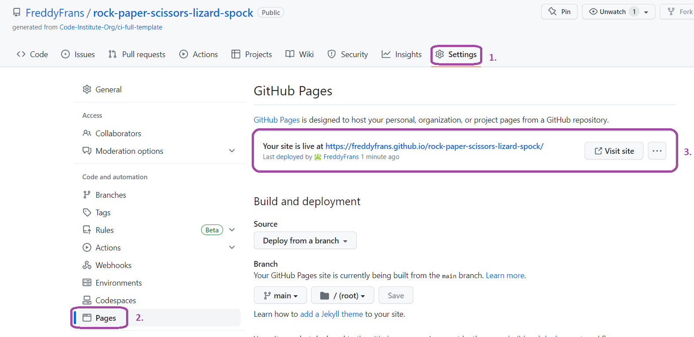
## Credits
  - ### Content
    - The game layout comes from pritishnagpal at www.geeksforgeeks.org
  - ### Rules
    - Game roules comes from [bigbangtheory.fandom.com](https://bigbangtheory.fandom.com/wiki/Rock,_Paper,_Scissors,_Lizard,_Spock)
  - ### Icons
    - Player vs Computer icons comes from [Font Awesome](https://fontawesome.com/)
## General problem solving credits
- [www.w3schools.com](https://www.w3schools.com/)
- [www.stackoverflow.com](https://stackoverflow.com/)
- [www.codeinstitute.net](https://codeinstitute.net/se/full-stack-software-development-diploma/?utm_term=code%20institute&utm_campaign=CI+-+SWE+-+Search+-+Brand&utm_source=adwords&utm_medium=ppc&hsa_acc=8983321581&hsa_cam=14660337051&hsa_grp=134087657984&hsa_ad=635849372549&hsa_src=g&hsa_tgt=kwd-319867646331&hsa_kw=code%20institute&hsa_mt=e&hsa_net=adwords&hsa_ver=3&gad=1&gclid=Cj0KCQjwmtGjBhDhARIsAEqfDEcSTRmuJ8L_geht9gBSV55XwEgD5x7EYk0FVLy0ubneZrZtuTHDk_oaAlHfEALw_wcB)
- [www.slack.com](https://slack.com/trials?remote_promo=f4d95f0b&d=7013y000002pzFpAAI&nc=7013y000002pzo3AAA&utm_source=google&utm_medium=paid_search&utm_campaign=ppc_google_emea_se_en_brand_selfserve_discount&utm_content=slack-pg-ss-all-nl-brand_7013y000002pzFpAAI&utm_term=slack_exact_._slack_._e_._c_._659186599814&gad=1&gclid=Cj0KCQjwmtGjBhDhARIsAEqfDEcmhiPHjBkN80_zTJw0oYrcUQsh0VfKWX4gBkDDDSuyhTknxpZlTaIaAvSSEALw_wcB&gclsrc=aw.ds)
## Acknowledgements
 ### The site was completed as a Portfolio 2 Project for the Full Stack Software Developer (e-Commerce) Diploma at the Code Institute.
   - I would like to thank Cohort Facilitator Alan Bushell, at Code Institute for the support in this project.
   - Shoutout to my friend Kristofer Gabrielsson for tips and tricks.
   - Big thanks to my classmate Frank Arellano for help with code troubleshooting.
   - Last but not least, pritishnagpal at www.geeksforgeeks.org who has given me more insight in JavaScript. Thank you!

