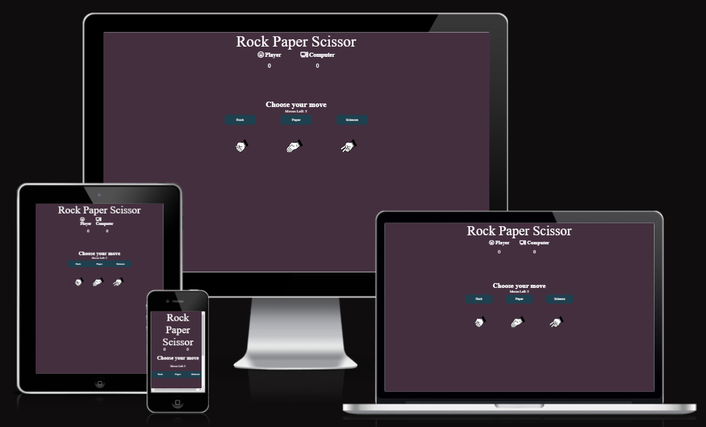
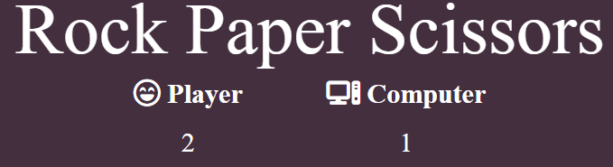
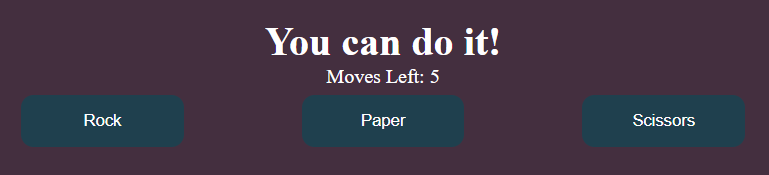

# Rock, Paper & Scissors
 ## Foreword
 I took on this challenge with no JavaScript knowledge whatsoever. Before the visitor try this game I want to give the credit to pritishnagpal at www.geeksforgeeks.org who gave me some more insight into how the structure of Javascript works.
 So thank you very much pritishnagpal!
 ## The Game
 
 The Rock, Paper and Scissors game has three option buttons: rock, paper or scissors. When the player clicks on an option, a comment is displayed where you find out if the player or the computer won, or if it was a draw. You have five attempts before the game is over. You can then click on a button that appears if you want to try to play again.
 

## Features

* ### Heading and Score
Here you can see logo Rock, Paper Scissors, player and computer with each font awesome image icons to make it more fun. Under the player and computer you can se the scoreboard.

* ### Playing Field
Here the player gets three options, where they choose rock, paper or scissors.
You have a total of five attempts before the game is over.
